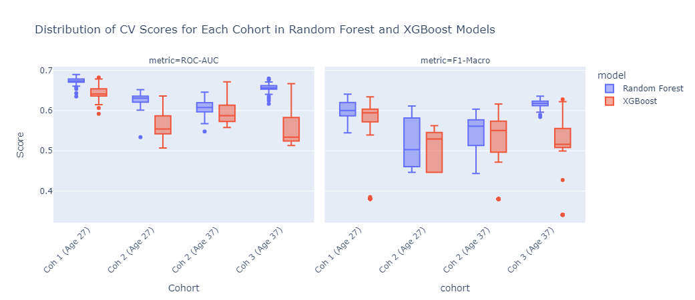
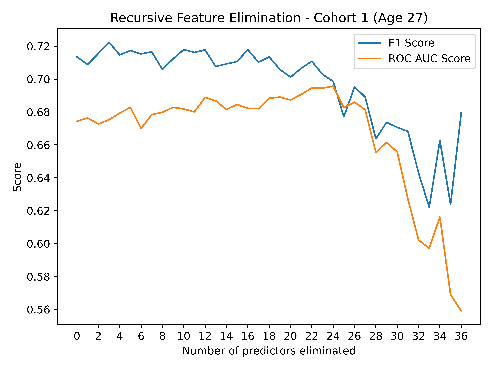
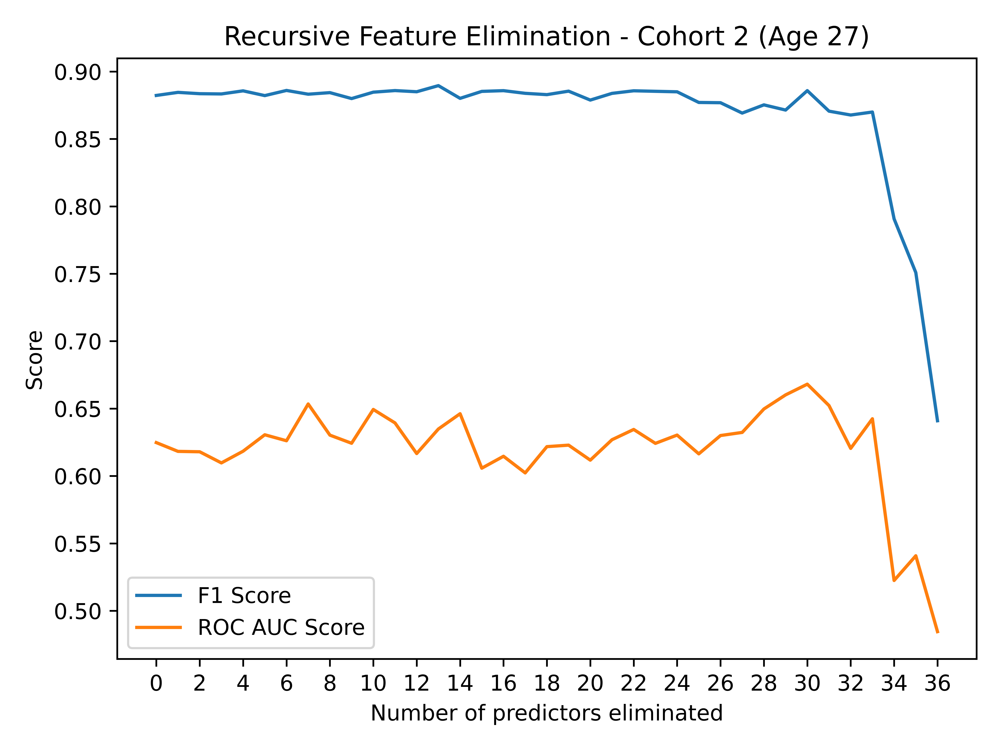
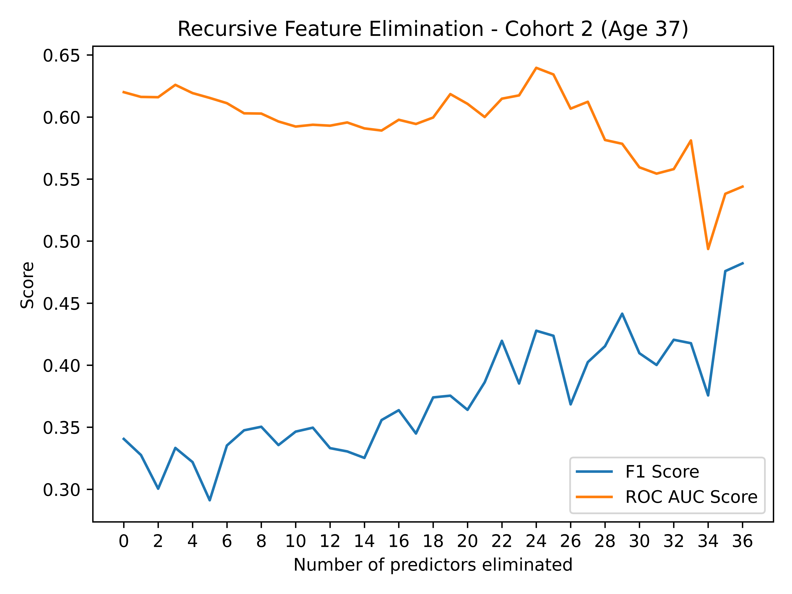
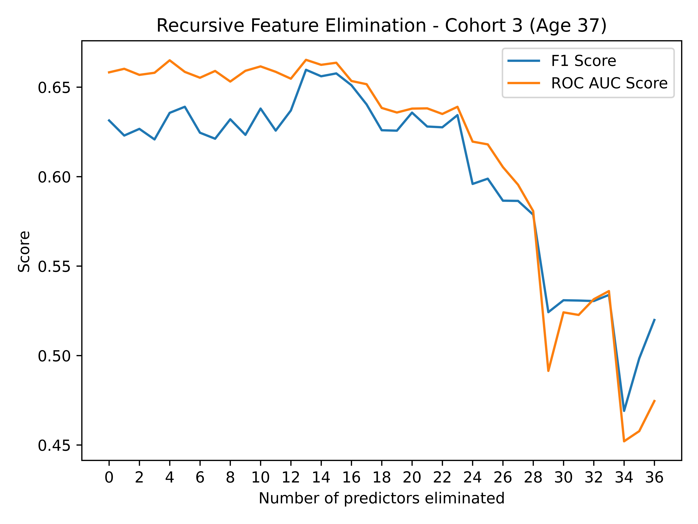
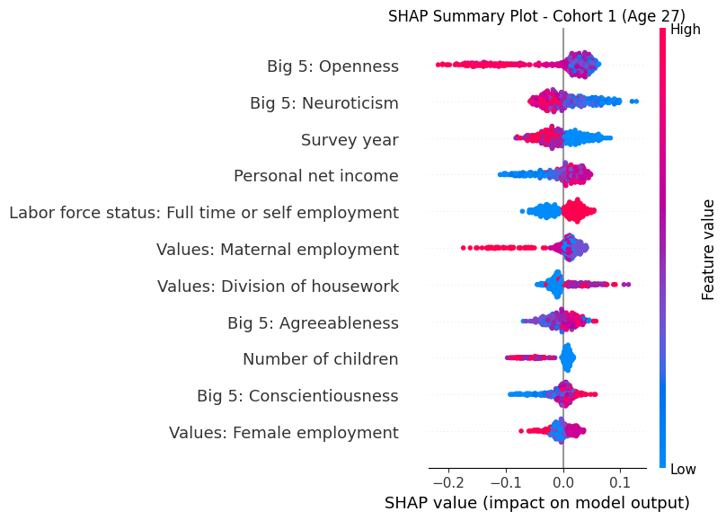
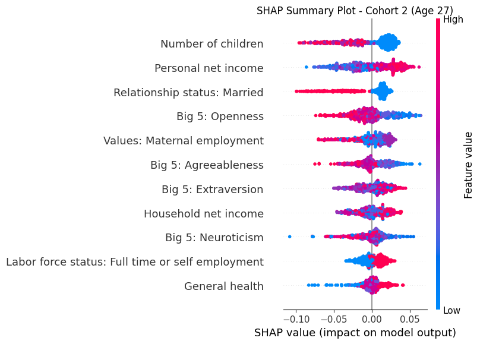
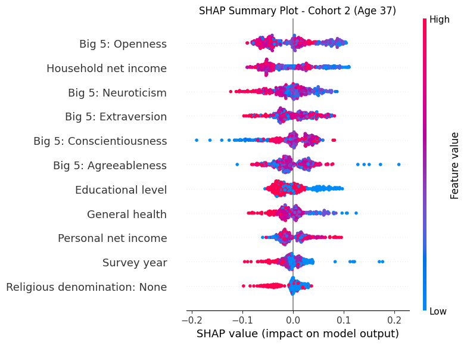
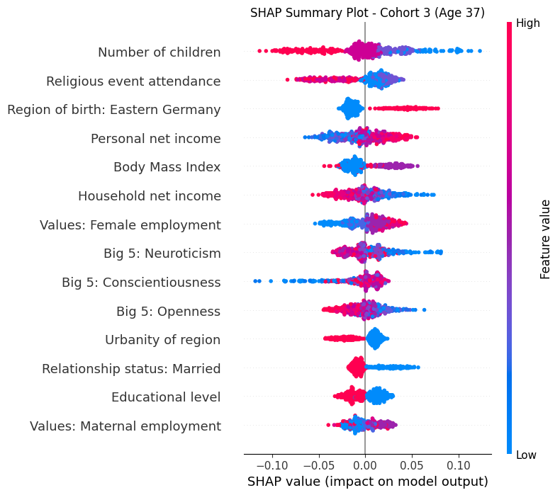

#  A machine learning approach: [Generational trends and predictors of hormonal contraceptive use in Germany](https://projectcontraception.github.io/sp1.html)
Authored by [Theresa Nutz](https://theresanutz.github.io/), [Nora Müller](https://nrmllr.github.io/), and [Hao-Ting Chan](https://www.linkedin.com/in/bryanchan97/)

## Abstract
The introduction of the contraceptive pill revolutionized women's reproductive health, but recent years have seen a decline in its use among younger women in Germany. This project investigates this trend using a machine learning approach.

### Key Contributions
- Examine generational variation in hormonal contraceptive use across birth cohorts.
- Analyze the predictive power of 25 variables on hormonal contraceptive use using Random Forest and XGBoost models.
- Identify key predictors across cohorts and interpret prediction patterns, including non-linearities and interactions.
- Analyze data from the pairfam (Panel Analysis of Intimate Relationships and Family Dynamics) study.

## Data Source
This study utilizes data from the [pairfam](https://www.pairfam.de/en/data/) (Panel Analysis of Intimate Relationships and Family Dynamics) for Germany.

## Machine Learning Models
This project will compare the performance of Decision Tree, Random Forest, and XGBoost models to determine which approach is most effective for predicting hormonal contraceptive use. The final results and metrics will be documented in the full report.

A preliminary comparison of our Random Forest and XGBoost model on the Validation set shows us that the Random Forest model performs better.

We employed a custom **Recursive Feature Elimination** (RFE) step to narrow-down the top most relevant predictors based on F-score and the ROC-AUC metric.
<table>
  <tr>
    <td></td>
    <td></td>
  </tr>
  <tr>
    <td></td>
    <td></td>
  </tr>
</table>

## Results
- We observed a 'period differences', with a shift from **family-demographic** to **personality** factors throughout the 2010s
- We also observed variations of key predictors among cohorts in the same survey years: cohort differences
<table>
  <tr>
    <td></td>
    <td></td>
  </tr>
  <tr>
    <td></td>
    <td></td>
  </tr>
</table>

